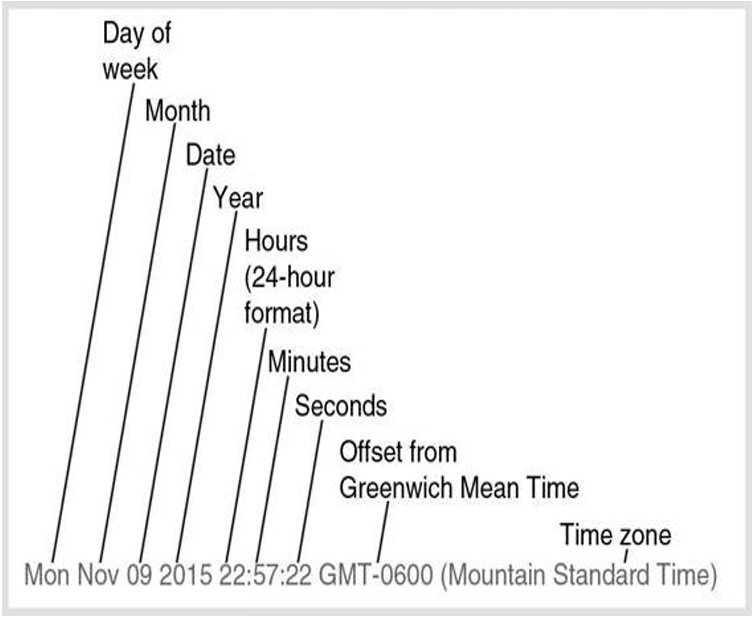

# Numbers

## Numbers: Converting strings to numbers, numbers to strings

`parseInt` converts a string into an integer and `parseFloat` converts a string representing a number into a floating-point number.

You can finesse the distinction between integers and floating-point numbers by using `Number`

```
var intNum = Number("123");       // Output: 123
var floatNum = Number("123.45");        // Output: 123.45
var floatFromStringWithNonDigits = Number("123.45abc"); // Output: NaN

var intFromStringWithLeadingSpaces = Number("   123"); // Output: 123
var floatFromStringWithLeadingSpaces = Number("   123.45"); // Output: 123.45
```

**Convert numbers to string**
```
var numAsNum = 12345;
var numAsString = numAsNum.toString();
console.log(numAsString);   //output: 12345
```

## Numbers: Controlling the length of decimals

```
var total = 10.596175;
var prettyTotal = total.toFixed(2);
console.log(prettyTotal);   //output: 10.60
console.log(total.toFixed(5));  //output: 10.59618
console.log(total.toFixed(3));  //output: 10.596
```

1
<hr>
2

# Date and time

## Getting the current data and time

```
var currentDateTime = new Date();
//output: Wed Nov 29 2023 21:15:45 GMT+0500 (Pakistan Standard Time)
```

The above code create a *Date Object*. This is what it looks like
||
|--|
|*This image is taken from the book "A smarter way to learn JavaScript by Mark Myers.*|


The date object is looking like a string but, it's not. You you cannot use string methods like `slice`, `indexOf`, `charAt` and etc on it.

If you need the *Date object* to be string, you can convert it. As you do a number to a string

```
var dateString = currentDateTime.toString();
```

## Extracting parts of the date and time
## Specifying a date and time
## Changing elements of a date and time
